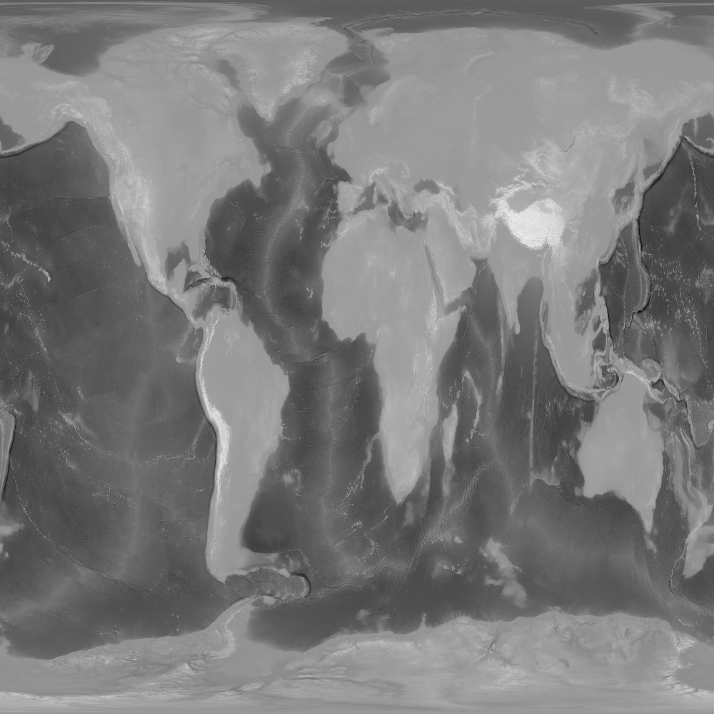
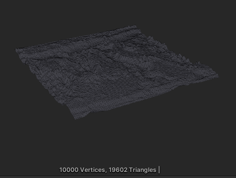

# Unity Procedural Mesh Creation from Gray Scale Image

An example script to generate terrain meshes from grayscale image. Color value on grayscale image represent height of the terrain.

**See demo**

https://youtu.be/PSQqMNPLfdk

**Input Grayscale Image**

**Output Mesh**

